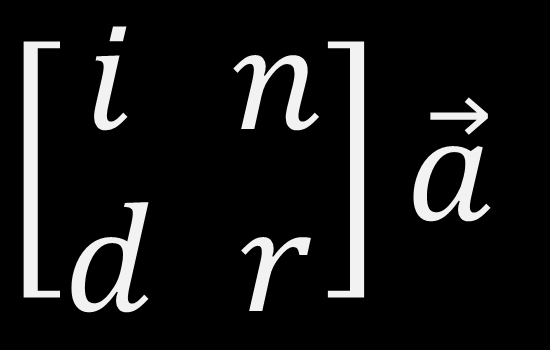

[](https://travis-ci.org/Lambda-3/indra)

# Indra

Indra is a Web Service which allows easy access to several [Distributional Semantics Models](https://en.wikipedia.org/wiki/Distributional_semantics), currently in English, German, Spanish, French, Portuguese, Italian, Swedish, Chinese, Dutch, Russian, Korean, Arabic, Japanese and Persian.

The Supported models are:
* [Latent Semantic Analysis (LSA)](https://en.wikipedia.org/wiki/Latent_semantic_analysis)
* [Explicit Semantic Analysis (ESA)](https://en.wikipedia.org/wiki/Explicit_semantic_analysis)
* [Word2Vec (W2V)](https://en.wikipedia.org/wiki/Word2vec)
* [Global Vectors (GloVe)](https://en.wikipedia.org/wiki/GloVe_(machine_learning))

# Usage

If you want to give a try on your own infrastructure take a look on [Indra-Composed](https://github.com/Lambda-3/indra-composed).

# JSON over HTTP API (REST like ;)

This is the payload consumed by Indra to compute [Semantic Similarity](https://en.wikipedia.org/wiki/Semantic_similarity) between words or phrase pairs.


```json
{
	"corpus": "wiki-2014",
	"model": "W2V",
	"language": "EN",
	"scoreFunction": "CORRELATION",
	"pairs": [{
		"t2": "father",
		"t1": "mother"
	}]
}
```

* model: The distributional model
 * W2V
 * GLOVE
 * LSA 
 * ESA

* language: Two-letter-code [ISO 639-1] (https://en.wikipedia.org/wiki/List_of_ISO_639-1_codes).
 * EN - English
 * DE - German
 * ES - Spanish
 * FR - French
 * PT - Portuguese
 * IT - Italian
 * SV - Swedish
 * ZH - Chinese
 * NL - Dutch
 * RU - Russian
 * KO - Korean
 * JP - Japanese
 * AR - Arabic
 * FA - Persian

* corpus: The name of the corpus used to build the models.
 * wiki-2014 (except JP and KO)
 * wiki-2016 (only JP and KO)

* scoreFunction: The function to compute the relatedness between the distributional vectors
 * COSINE
 * ALPHASKEW
 * CHEBYSHEV
 * CITYBLOCK
 * SPEARMAN
 * PEARSON
 * DICE
 * EUCLIDEAN
 * JACCARD
 * JACCARD2
 * JENSENSHANNON


